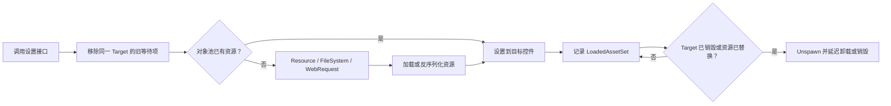

# AssetSet 资源设置

AssetSet 为“把资源设置到目标控件”提供统一生命周期。它负责加载、请求合并、缓存命中、目标替换和延迟回收，适合运行时频繁变化的图标、头像、活动图片与本地缓存图片。

项目已为 `Image`、`UXImage` 和 `RawImage` 提供同步触发与 UniTask 等待接口。业务通常调用扩展方法，不需要直接管理 `ResourceComponent.UnloadAsset` 或 `UnityEngine.Object.Destroy`。

## 1. 解决的问题

直接加载资源后赋给 UI 控件，调用方还要处理重复请求、界面关闭、图片被替换和资源释放。AssetSet 用 `Target + AssetPath + AssetType` 描述一次设置，并持续跟踪目标是否仍持有该资源。

AssetSet 不是通用资源容器。需要一组资源跟随 UIForm、Entity 或业务对象整体释放时，使用 `ResourceContainer`；需要让单个显示控件自动替换与回收图片时，使用 AssetSet。

## 2. 运行链路



Resource 按“路径 + 类型”合并加载。WebRequest 按请求路径合并下载；一次结果可以设置给多个等待目标。新请求指向同一 `Target` 时，尚未完成的旧请求会被移出等待队列。

## 3. 组件与默认配置

`AssetSetComponent` 已挂在 `Unity/Assets/Res/GameEntry.prefab`。`GameEntry.Start()` 会把它缓存到 `GameEntry.AssetSet`，业务入口启动后可直接使用。

组件依赖 GF 的 `ResourceComponent`、`ObjectPoolComponent`、`FileSystemComponent`、`WebRequestComponent` 与 `EventComponent`。复制 GameEntry 配置时不要只复制 AssetSet 组件。

| 配置 | 当前值 | 作用 |
| --- | --- | --- |
| 释放检查间隔 | 30 秒 | 检查目标是否销毁或已换图 |
| 对象池自动释放间隔 | 60 秒 | 触发池内对象整理 |
| 对象池容量 | 16 | AssetSet 资源对象池容量 |
| 对象过期时间 | 60 秒 | 无引用资源的池内保留时间 |
| 文件系统初始文件数 | 64 | 缓存文件达到上限后迁移扩容 |
| 读取缓冲区 | 64 KiB | 文件较大时按 2 倍自动扩容 |

这些值来自当前 `GameEntry.prefab`。它们是缓存策略，不是并发限制；应根据界面换图频率、头像数量和内存预算调整。

## 4. 内置接口

| 目标 | 来源 | 同步触发 | 等待完成 | 持久化 |
| --- | --- | --- | --- | --- |
| `Image` | GF Resource | `SetSprite` | `SetSpriteAsync` | 否 |
| `UXImage` | GF Resource | `SetSprite` | `SetSpriteAsync` | 否 |
| `RawImage` | GF Resource | `SetTextureByResource` | `SetTextureByResourceAsync` | 否 |
| `RawImage` | AssetSet FileSystem | `SetTextureByFileSystem` | `SetTextureByFileSystemAsync` | 读取缓存 |
| `RawImage` | WebRequest | `SetTextureByWebRequest` | `SetTextureByWebRequestAsync` | 是 |

“同步触发”只表示方法立即返回，资源加载仍在后台完成。需要在设置成功后继续执行逻辑时，应使用带 `Async` 的接口。

GF 资源键包含路径与类型。同一个 PNG 路径可以为 `Image` 加载为 `Sprite`，也可以为 `RawImage` 加载为 `Texture2D`；编辑器缓存、加载中集合和运行时资源池不会发生键冲突。

## 5. 常用示例

### 设置 Image 或 UXImage

资源路径直接交给 GF `ResourceComponent.LoadAsset`，因此必须已进入 ResourceCollection，并使用完整 Unity 资源路径。

```csharp
using Cysharp.Threading.Tasks;
using Game;
using UnityEngine.UI;

public static async UniTask SetWorldIconAsync(Image icon, UXImage uxIcon)
{
    const string path = "Assets/Res/UI/UISprite/Icon/world.png";
    await icon.SetSpriteAsync(path);
    await uxIcon.SetSpriteAsync(path);
}
```

不依赖加载完成时，可使用 `icon.SetSprite(path)`。同一路径与类型只会发起一次 Resource 加载，多个目标共享池中的同一资源。

### 设置 Resource 中的 RawImage

```csharp
using Cysharp.Threading.Tasks;
using Game;
using UnityEngine.UI;

public static UniTask SetLogoAsync(RawImage image)
{
    return image.SetTextureByResourceAsync(
        "Assets/Res/UI/UISprite/Logo/unity-logo.png");
}
```

### 下载并缓存远程图片

```csharp
using Cysharp.Threading.Tasks;
using Game;
using UnityEngine.UI;

public static UniTask SetAvatarAsync(RawImage avatar, long playerId)
{
    string url = $"https://cdn.example.com/avatar/{playerId}.png";
    return avatar.SetTextureByWebRequestAsync(url);
}
```

WebRequest 扩展默认启用持久化。它先用完整 URL 查询 AssetSet FileSystem；命中时直接读取，未命中时下载、转换为 `Texture2D` 并保存原始字节。

通常每次都调用 `SetTextureByWebRequestAsync` 即可，不需要先手工判断 `HasFile`。同一 URL 的内容更新时应优先使用版本化 URL，避免同时命中内存对象池与持久化缓存。

## 6. 请求合并与释放

### 请求合并

Resource 使用 `AssetPath + AssetType` 作为键。WebRequest 使用 `AssetPath` 作为下载键。多个控件请求相同资源时共享一次加载结果，但每个控件仍拥有独立的 `IAssetSet` 跟踪记录。

### 同一目标换图

新请求会先移除同一 `Target` 的旧等待项。若旧项是 Waitable 类型，其 UniTask 会进入取消状态。已经设置完成的旧资源会在控件改图后，由下一次 `ReleaseUnused()` 检查发现并回收。

### 底层资源释放

| 来源 | 最终释放方式 |
| --- | --- |
| GF Resource | `ResourceComponent.UnloadAsset` |
| FileSystem / WebRequest | `UnityEngine.Object.Destroy` |

释放记录时先对多实例对象池执行 `Unspawn`。只有引用计数归零并满足池策略后，底层 Sprite 或 Texture 才会真正卸载或销毁。

### 文件缓存扩容

缓存位于 `Application.persistentDataPath` 下的 `AssetSetFileSystem_1.dat` 或 `AssetSetFileSystem_2.dat`。文件数量达到上限时，组件创建另一份文件系统、迁移现有内容并扩大容量。

## 7. 异步、取消与失败

Waitable 类型通过 `AutoResetUniTaskCompletionSource` 返回 UniTask。成功设置资源时完成任务；对象被替换、加载失败或等待项被清理时，`Clear()` 会把任务置为取消。

当前便捷接口没有 `CancellationToken` 参数，也不会把 GF 的具体加载错误转换成业务异常。调用方需要区分“完成”和“取消”，具体失败原因查看日志。

```csharp
try
{
    await image.SetSpriteAsync(path);
}
catch (System.OperationCanceledException)
{
    // 目标换图、加载失败或等待队列被清理。
}
```

需要场景切换时统一取消尚未完成的设置，可调用 `GameEntry.AssetSet.RemoveAllLoadingAssetSet()`。该方法只处理等待项，已设置资源仍按目标状态和对象池规则释放。

## 8. 自定义 AssetSet

自定义目标至少继承 `AssetSet<T>`，实现赋值、可释放判断和清理。实例应从 `ReferencePool` 获取，并在 `Create` 中设置 `AssetPath` 与 `Target`。

```csharp
using GameFramework;
using UnityEngine;
using UnityGameFramework.Extension;

public sealed class SpriteRendererSet : AssetSet<Sprite>
{
    private SpriteRenderer m_Renderer;
    private Sprite m_Current;

    public static SpriteRendererSet Create(
        SpriteRenderer renderer, string assetPath)
    {
        SpriteRendererSet result =
            ReferencePool.Acquire<SpriteRendererSet>();
        result.m_Renderer = renderer;
        result.AssetPath = assetPath;
        result.Target = renderer;
        return result;
    }

    public override void SetAsset(Sprite asset)
    {
        if (m_Renderer == null)
        {
            return;
        }

        m_Renderer.sprite = asset;
        m_Current = asset;
    }

    public override bool IsCanRelease()
    {
        return m_Renderer == null ||
               (m_Current != null && m_Renderer.sprite != m_Current);
    }

    public override void Clear()
    {
        base.Clear();
        m_Renderer = null;
        m_Current = null;
    }
}
```

```csharp
Game.GameEntry.AssetSet.SetByResource(
    SpriteRendererSet.Create(renderer, spritePath));
```

从 FileSystem 读取时还要实现 `ISerializeAssetSet`。使用 WebRequest 时必须同时实现 `ISerializeAssetSet` 与 `ISaveAbleAssetSet`；`NeedSave` 决定下载后是否写入持久化缓存。

## 9. 常见问题

### `GameEntry.AssetSet` 为 null

确认场景使用 `Unity/Assets/Res/GameEntry.prefab`，且调用发生在 `GameEntry.Start()` 完成之后。自建 GameEntry 时还要配置 AssetSet 所依赖的五个 GF 组件。

### Async 方法被取消

常见原因是同一控件立即请求了另一张图、资源加载失败，或代码调用了 `RemoveAllLoadingAssetSet()`。先检查最早的 Resource/WebRequest 错误日志。

### 远程图片没有更新

完整 URL 同时作为下载地址和缓存键。URL 不变时会优先使用旧缓存。发布新图片时推荐改变版本参数或文件名。

`DeleteByFileSystem(url)` 只删除持久化文件；同键资源仍可能存在于内存对象池。因此它适合清理磁盘缓存，不保证下一次调用立即重新下载。

### 换图后内存没有立即下降

默认每 30 秒检查一次目标，每 60 秒整理对象池。需要立即触发检测时调用 `GameEntry.AssetSet.ReleaseUnused()`；底层资源仍可能按对象池过期策略保留一段时间。

### FileSystem 读取失败

`SetTextureByFileSystem` 只读取 AssetSet 自己的虚拟文件系统，不读取任意磁盘路径。通常应先通过 WebRequest 接口写入缓存，并使用完全相同的键读取。

## 10. 关键代码

| 作用 | 文件 |
| --- | --- |
| 接口与抽象基类 | `Library/UGF/UnityGameFramework.Extension/Runtime/AssetSet/IAssetSet.cs` |
| 组件与释放检查 | `Library/UGF/UnityGameFramework.Extension/Runtime/AssetSet/AssetSetComponent.cs` |
| GF Resource 加载 | `Library/UGF/UnityGameFramework.Extension/Runtime/AssetSet/AssetSetComponent.Resource.cs` |
| WebRequest 与落盘 | `Library/UGF/UnityGameFramework.Extension/Runtime/AssetSet/AssetSetComponent.WebRequest.cs` |
| FileSystem 缓存 | `Library/UGF/UnityGameFramework.Extension/Runtime/AssetSet/AssetSetComponent.FileSystem.cs` |
| Image / RawImage 实现 | `Library/UGF/UnityGameFramework.Extension/Runtime/AssetSet/` |
| 项目便捷接口 | `Game/AssetSet/SetSpriteExtension.cs` |
| UXImage 实现 | `Game/AssetSet/UXImageSet.cs` |
| UXTool 本地化图片接入 | `Library/UXTool/Runtime/Common/UnityExtension/ResourceManager.cs` |

相关 UI 创建与生命周期见 [UI 开发](UI开发.md)。
