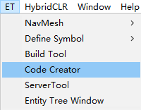
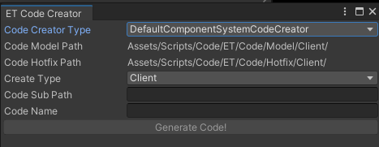
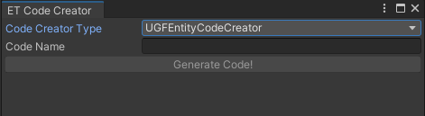
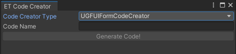

# [ET代码工具]

按模板生成ET代码，可以继承[ICodeCreator](../Unity/Assets/Scripts/Game/ET/Editor/CodeCreator/ICodeCreator.cs)来自定义

1.默认类的Model和Hotfix代码生成

2.UGFEntity功能的Model,Hotfix,Event代码生成

3.UGFUI功能的Model,Hotfix,Event代码生成

