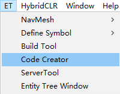
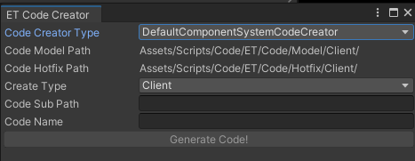
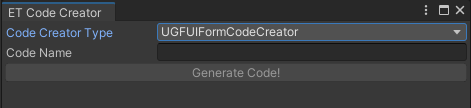
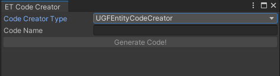

# ET 代码生成工具

`ET/Code Creator` 根据模板一次生成 Model、System 与 Mono 视图骨架。它解决重复结构，不替代配置、资源制作、CodeBind 或业务设计。

## 打开工具

先启用 `UNITY_ET`，再选择 Unity 菜单：

```text
ET/Code Creator
```

窗口会扫描 `Game.ET.Editor` 程序集内所有实现 `ICodeCreator` 的非抽象类，并显示在 `Code Creator Type` 下拉框中。



## 内置生成器

| 生成器 | 产物 | 是否创建资源 |
| --- | --- | --- |
| `DefaultComponentSystemCodeCreator` | Component + System | 否 |
| `UIFormCodeCreator` | UIForm + System + Mono | 创建 UIForm prefab |
| `UIWidgetCodeCreator` | UIWidget + System + Mono | 否 |
| `UGFEntityCodeCreator` | GFEntity + System + Mono | 否 |

所有生成器都拒绝覆盖已有 `.cs` 文件。生成前先确认名称与目标目录；失败后不要删除不属于本次生成的文件。

## 默认 Component/System

`DefaultComponentSystemCodeCreator` 提供四种路径类型：

| 类型 | Model 输出 | System 输出 | 命名空间 |
| --- | --- | --- | --- |
| `Client` | `Code/Model/Client` | `Code/Hotfix/Client` | `ET.Client` |
| `Server` | `Code/Model/Server` | `Code/Hotfix/Server` | `ET.Server` |
| `Share` | `Code/Model/Share` | `Code/Hotfix/Share` | `ET` |
| `View` | `Code/ModelView/Client` | `Code/HotfixView/Client` | `ET.Client` |

`Code Sub Path` 会同时附加到 Model 与 System 路径。输入 `Inventory/Item` 这类分层路径前，应确认最终命名空间仍符合项目约定。

模板：

```text
Assets/Res/Editor/ET/Config/DefaultCodeTemplate.txt
Assets/Res/Editor/ET/Config/DefaultSystemCodeTemplate.txt
```



## UIForm

输入 `Login` 会生成：

```text
Code/ModelView/Client/Game/UI/UILogin/UIFormLogin.cs
Code/ModelView/Client/Game/UI/UILogin/MonoUIFormLogin.cs
Code/HotfixView/Client/Game/UI/UILogin/UIFormLoginSystem.cs
Assets/Res/UI/UIForm/UIFormLogin.prefab
```

生成器先创建代码和空 UIForm prefab。脚本重载后，通过 `DidReloadScripts` 把 `MonoUIFormLogin` 挂到预制体。

如果预制体已存在，工具只记录警告并保留资源；如果任一代码文件已存在，则抛出异常并停止。生成器不会写 `UI.xlsx`。

完整接入流程见 [UI 开发](UI开发.md)。



## UIWidget

输入 `Item` 会生成 `UIWidgetItem`、`UIWidgetItemSystem` 与 `MonoUIWidgetItem`，目录位于 `Game/UI/UIItem`。

UIWidget 生成器不创建 prefab。可把 Mono 组件挂到已有 UIForm 子节点，或创建 UIEntity 资源后通过 `LoadChildUIWidgetAsync` 动态加载。

## UGFEntity

输入 `Player` 会生成：

```text
Code/ModelView/Client/Game/GFEntity/Player/GFEntityPlayer.cs
Code/ModelView/Client/Game/GFEntity/Player/MonoGFEntityPlayer.cs
Code/HotfixView/Client/Game/GFEntity/Player/GFEntityPlayerSystem.cs
```

生成器不创建 Entity prefab，也不写 `Entity.xlsx`。需要自行创建资源、挂载 `MonoGFEntityPlayer`、配置表并导出。

完整接入流程见 [Entity 开发](Entity开发.md)。



## 模板约定

内置模板位于：

```text
Unity/Assets/Res/Editor/ET/Config/
```

模板使用 `#NAME#` 替换代码名。默认 Component 模板还使用 `#NAMESPACE#`。

修改模板会影响后续生成，不会回写已有代码。提交模板修改时，应同时检查四类生成器的命名与接口是否仍匹配运行时。

## Code Name 规则

窗口只禁用空名称和包含空格的名称，不会完整验证 C# 标识符或路径字符。建议使用 PascalCase 的单个类型名，例如 `Login`、`InventoryItem`。

不要输入后缀：UIForm 生成器会自动添加 `UIForm`，Entity 生成器会自动添加 `GFEntity`，Widget 生成器会自动添加 `UIWidget`。

## 自定义生成器

`ICodeCreator` 是 `Game.ET.Editor` 程序集内的 internal 接口，因此自定义实现应放在 `Unity/Assets/Scripts/Game/ET/Editor/` 下，确保编译进同一程序集。

```csharp
namespace ET.Editor
{
    internal sealed class ServiceCodeCreator : ICodeCreator
    {
        public void OnEnable()
        {
        }

        public void OnGUI()
        {
        }

        public void GenerateCode(string codeName)
        {
            // 校验输入、读取模板、拒绝覆盖、写入目标文件。
        }
    }
}
```

无需手工注册。窗口重开或脚本重载后，会通过反射发现新类型。

自定义实现至少应做到：目标文件存在时拒绝覆盖、模板缺失时明确报错、创建父目录、输出完整路径，并让生成结果具有稳定格式。

## 生成后的检查清单

1. 补齐 `[ComponentOf]` 或其他所有权特性。
2. 只保留真正需要的生命周期接口。
3. 对 UI/Entity 添加 Excel 配置并重新导表。
4. 给 prefab 挂正确 Mono 组件并完成 CodeBind。
5. 等待 Unity 编译，再从实际所有者创建实体。
6. 不需要的模板方法应删除，避免空 Update 或无意义接口注册。

## 常见问题

### 下拉框为空

确认 `UNITY_ET` 已启用，Unity 没有编译错误，并检查 `Game.ET.Editor` 程序集是否正常加载。

### 生成 UI 后 Mono 没挂上

等待脚本重载完成。工具通过 EditorPrefs 保存待处理名称，重载回调只能在生成类成功编译后取得类型。

### 提示文件已存在

生成器不会合并或覆盖。选择新名称，或人工判断现有文件与模板的关系后再处理；不要批量删除目录。

### 自定义生成器没有显示

确认它是非抽象类、实现 `ICodeCreator`，并与 `CodeCreatorEditor` 位于同一程序集。接口是 internal，其他程序集无法直接实现。

## 关键代码

| 作用 | 文件 |
| --- | --- |
| 窗口与发现逻辑 | `Game/ET/Editor/CodeCreator/CodeCreatorEditor.cs` |
| 扩展接口 | `Game/ET/Editor/CodeCreator/ICodeCreator.cs` |
| 默认生成器 | `Game/ET/Editor/CodeCreator/DefaultComponentSystemCodeCreator.cs` |
| UIForm 生成器 | `Game/ET/Editor/CodeCreator/UIFormCodeCreator.cs` |
| UIWidget 生成器 | `Game/ET/Editor/CodeCreator/UIWidgetCodeCreator.cs` |
| Entity 生成器 | `Game/ET/Editor/CodeCreator/GFEntityCodeCreator.cs` |
