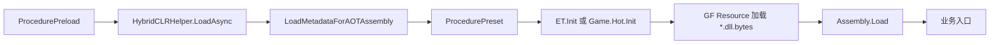

# HybridCLR 热更新

GDK 用 `UNITY_HOTFIX` 控制 HybridCLR 工作流。ET 与 GameHot 仍由各自 Loader 启动，但业务程序集从 Unity 内置程序集切换为 `.dll.bytes` 资源，并在 IL2CPP Player 中加载 AOT 补充元数据。

## 先理解两个开关

| 开关 | 决定什么 |
| --- | --- |
| `UNITY_ET` / `UNITY_GAMEHOT` | 选择哪套业务模块 |
| `UNITY_HOTFIX` | 该模块是否以 DLL 资源方式加载 |

旧文档中的 `UNITY_HOT` 已不再使用。当前菜单是 `Game/Define Symbol/Add UNITY_HOTFIX`。

## 热更新程序集

### ET

```text
Game.ET.Code.Model
Game.ET.Code.ModelView
Game.ET.Code.Hotfix
Game.ET.Code.HotfixView
```

输出到 `Unity/Assets/Res/ET/Code/`。ET 运行时重载只重新加载 Hotfix 与 HotfixView；Model 与 ModelView 在启动阶段确定。

### GameHot

```text
Game.Hot.Code
```

输出到 `Unity/Assets/Res/Hot/Code/`。入口 prefab 与 Loader 仍属于稳定层。

两种编译工具还会把原始 DLL/PDB 复制到 `Unity/Temp/HybridCLRBin`，并把该目录注册为 HybridCLR 外部热更新程序集目录。

## 启用热更新

1. 先选择 `UNITY_ET` 或 `UNITY_GAMEHOT`。
2. 选择 `Game/Define Symbol/Add UNITY_HOTFIX`。
3. 等待 Unity 编译完成。
4. 确认当前 Build Target 已切到目标平台。
5. 执行 `Game/Define Symbol/Refresh`。

Refresh 会同步启用 HybridCLR、更新 `link.xml` 条件区块、热更新程序集列表、AOT 补充程序集列表和外部 DLL 目录。

不要只在 Player Settings 中手工添加宏。那样不会同步资源规则、Luban 工程与 HybridCLR 设置。

## 一键准备

使用：

```text
HybridCLR/Do All
```

当前代码按以下顺序执行：

1. `Game/Define Symbol/Refresh`
2. `GameHot/Compile Dll`，仅在 GameHot + Hotfix 时执行
3. `ET/Compile Dll`，仅在 ET + Hotfix 时执行
4. `HybridCLR/Generate/All`
5. `HybridCLR/CopyAotDlls`

因此不需要在 Do All 前重复手工编译业务 DLL。单独验证 DLL 编译时才使用模块自己的 Compile Dll 菜单。

## DLL 编译过程

模块编译工具调用 `PlayerBuildInterface.CompilePlayerScripts`，目标平台使用当前 Active Build Target，额外添加 `UNITY_COMPILE` 和当前模块符号。

中间产物：

```text
Unity/Temp/Bin/Debug/<BuildTarget>/
```

随后复制为：

```text
Assets/Res/ET/Code/*.dll.bytes
Assets/Res/ET/Code/*.pdb.bytes
```

或：

```text
Assets/Res/Hot/Code/*.dll.bytes
Assets/Res/Hot/Code/*.pdb.bytes
```

切换模块或 Hotfix 模式时，DefineSymbol 工具会清理旧的临时 DLL 目录，避免目标平台和宏组合混用。

## AOT 补充元数据

`HybridCLR/CopyAotDlls` 从 HybridCLR 的 `strippedAOTDllOutputRootDir/<BuildTarget>` 读取 `patchAOTAssemblies`，复制到：

```text
Unity/Assets/Res/HybridCLR/*.dll.bytes
```

随后创建或更新：

```text
Unity/Assets/Res/HybridCLR/HybridCLRConfig.asset
```

该资产直接引用所有 AOT DLL TextAsset。列表来自当前 `link.xml`，通常不应手工维护；应修改裁剪配置并重新 Refresh、Do All。

## 运行时加载链路



`HybridCLRHelper.LoadAsync` 只在 `UNITY_HOTFIX && ENABLE_IL2CPP` 下执行。Mono Player 不需要加载 AOT 补充元数据。

ET Loader 根据 CodeMode 组装 CodeTypes，然后调用 `ET.Entry.Start`。GameHot Loader 加载 `Game.Hot.Code` 后实例化 `HotEntry.prefab`。

## 编辑器中的 DLL 模式

Player 中 `CodeRunner.EnableCodeBytesMode` 固定为 true。编辑器中由 `GameEntry.prefab` 的 `m_EnableEditorCodeBytesMode` 决定，当前默认关闭。

关闭时，即使启用了 `UNITY_HOTFIX`，编辑器也优先使用 Unity 已编译程序集，适合普通开发。开启后，Loader 会读取 `.dll.bytes`，用于验证真实热更新加载链路。

编辑器 DLL 模式会临时禁用 `Library/ScriptAssemblies` 中同名程序集，退出播放时恢复。不要在 Unity 正在切换播放状态时手工移动这些文件。

## ET 运行时重载

启用 Hotfix 并进入播放后，工具栏显示：

| 按钮 | 行为 |
| --- | --- |
| `ETCompile` | 编译 ET 全部业务 DLL |
| `ETReload` | 编译后调用 `CodeLoader.ReloadAsync()` |

`ETReload` 重新装载 Hotfix 与 HotfixView，重建 CodeTypes，并发布 `OnCodeReload`。已有实体数据不会自动迁移，新增字段与静态状态仍需谨慎处理。

GameHot 当前提供 `HotCompile`，没有与 ETReload 等价的运行中程序集替换入口。

## 推荐构建流程

1. 切换到目标 Build Target。
2. 选择业务模块和 CodeMode。
3. 启用 `UNITY_HOTFIX`。
4. 导出 Luban 与 Proto。
5. 执行 `HybridCLR/Do All`。
6. 确认 `Assets/Res/HybridCLR` 与模块 Code 目录已更新。
7. 使用 `Game/Build Tool Editor` 构建资源或安装包。

Build Target 必须先切换。AOT DLL、脚本编译产物与平台相关，不能用 Windows 的准备结果直接构建 Android 或 iOS。

## `link.xml` 与包体

`Unity/Assets/link.xml` 使用注释标记维护多组条件区块。`LinkXMLHelper` 根据 Hotfix、ET、GameHot 和 ET CodeMode 开关启用必要程序集，并移除无关保留项。

`HybridCLRTool.RefreshSettingsByLinkXML()` 再从启用后的 assembly 节点生成 `patchAOTAssemblies`。手工破坏区块标记会同时影响代码裁剪和 AOT 元数据列表。

## 常见问题

### 找不到 `ET/Compile Dll` 或 `GameHot/Compile Dll`

这些菜单只在 `UNITY_HOTFIX` 下编译。确认模块与 Hotfix 符号已启用，并等待 Unity 完成重编译。

### 找不到 DLL 或 PDB

先确认 Active Build Target，再单独执行模块 Compile Dll 查看最早的脚本编译错误。不要只检查复制阶段日志。

### `HybridCLRConfig.asset` 为空

执行 `Game/Define Symbol/Refresh` 后再运行 `HybridCLR/Do All`。同时检查 `link.xml` 是否仍包含有效 assembly 条目。

### Player 启动时资源加载失败

确认资源收集规则包含 `Assets/Res/HybridCLR` 与当前模块的 Code 目录，并在 DLL/AOT 更新后重新构建资源。

### 编辑器启用 DLL 模式后类型重复

停止播放，让 `BuildAssemblyHelper` 恢复 `Library/ScriptAssemblies` 中的 DLL。若 Unity 异常退出，检查同目录的 `.DISABLED` 文件并先备份现场再处理。

### 切换平台后仍使用旧 DLL

重新执行 `HybridCLR/Do All`。模块切换会清理临时目录，但单纯切换 Build Target 不等于重新生成所有平台产物。

## 关键代码

| 作用 | 文件 |
| --- | --- |
| 模式与设置同步 | `Game/Editor/DefineSymbol/DefineSymbolTool.cs` |
| Do All 与 AOT 复制 | `Game/Editor/HybridCLR/HybridCLREditor.cs` |
| HybridCLR 设置维护 | `Game/Editor/HybridCLR/HybridCLRTool.cs` |
| DLL 编译与复制 | `Game/Editor/Build/BuildAssemblyHelper.cs` |
| ET DLL 列表 | `Game/ET/Editor/Build/BuildAssemblyTool.cs` |
| GameHot DLL 列表 | `Game/Hot/Loader/Editor/Build/BuildAssemblyTool.cs` |
| AOT 运行时加载 | `Game/HybridCLR/HybridCLRHelper.cs` |

参考：[HybridCLR 官方仓库](https://github.com/focus-creative-games/hybridclr)。
