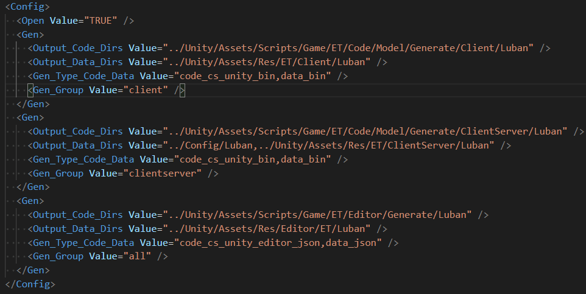

# [Luban工具](https://focus-creative-games.github.io/luban-doc/#/)

##  1.方便的处理多Luban目录（多Luban目录可以用来区分热更非热更等）
##  2.只用关心配置，不用去处理繁琐的生成命令
##  3.由于生成功能在Share.Tool.csproj中执行可以方便添加定义需求

***

## 使用
1.  打开Kit.sln项目后，编译整个项目
2.  运行Design/Excel/gen all.bat或Tools/Tool/ExcelExport即可

***

## 注意

1.  Luban的Excel工程目录目录必须是Design/Excel下，对目录命名不做要求

2.  Luban的Excel工程目录中需要有luban.conf文件才能生效，方便多程序集配置使用（热更，非热更等等）

3.  luban.conf配置
   - active -- 是否开启
   - cmds -- luban执行命令，具体查看[文档](https://luban.doc.code-philosophy.com/docs/manual/commandtools)
      - 自定义目录 
      - %UNITY_ASSETS% （Unity的Assets目录）
      - %CONF_ROOT% （当前luban.conf的目录）
      - %ROOT% （GDK根目录）



4.  导表自动生成GFUI和GFEntity的Id代码，类似导表后需要处理的需求可以在Share.Tool.csproj项目中添加

## 支持Reload：
```csharp
Tables.Instance.GetDataTable("TableName").LoadAsync(); 
```
