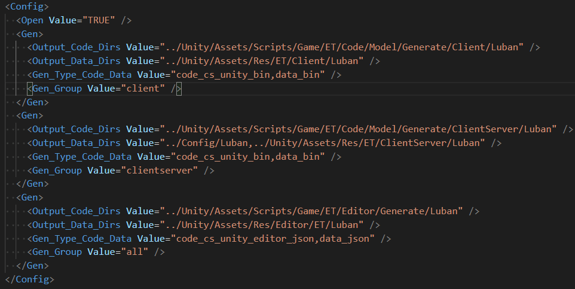

# Luban 配置与导表

GDK 在 Luban 之上增加了多工程发现、并行执行、路径变量、产物复制和二次代码生成。日常开发只维护 Excel 与各工程的 `luban.conf`，不需要手写完整命令行。

## 导出链路

```text
Design/Excel/*/luban.conf
  → Share.Tool 扫描 active 工程
  → 并行执行每条 Luban cmd
  → 复制多目标产物
  → 生成 UI / Entity / Scene / Sound 常量
  → 导出 Localization.xlsx
```

导出实现位于 `Share/Tool/ExcelExporter/`。Luban 可执行文件与自定义模板位于 `Tools/Luban/`。

## 前置条件

先在仓库根目录编译工具：

```powershell
dotnet build Kit.sln
```

构建后应存在 `Bin/Tool.exe`（Windows）或 `Bin/Tool.dll`。Unity 菜单和批处理最终都调用这个工具。

## 执行方式

### Unity 菜单

| 入口 | 输出格式 |
| --- | --- |
| `Game/Tool/ExcelExporter` | 代码 + 二进制数据 |
| `Game/Tool/ExcelExporterForJson` | 代码 + JSON 数据 |
| Toolbar 的 `ExportExcel` | 与 ExcelExporter 相同 |

Unity 入口会在导出后刷新 AssetDatabase，并清理 UXTool 的编辑器本地化缓存。

### 批处理

```text
Design/Excel/gen all bin.bat
Design/Excel/gen all json.bat
```

批处理会切换到 `Bin/` 再运行工具，因此相对路径能正确解析。

### 命令行

```powershell
Push-Location Bin
./Tool.exe --AppType=ExcelExporter --Console=1
./Tool.exe --AppType=ExcelExporter --Console=1 --Customs=Json
Pop-Location
```

macOS 或 Linux 使用 `dotnet Tool.dll`。

## 工程发现规则

工具只扫描 `Design/Excel/` 的直接子目录。目录中必须存在 `luban.conf`，且 `active` 为 `true`，其中的 `cmds` 才会执行。

当前工程包含：

| 工程 | 用途 | 模式 |
| --- | --- | --- |
| `Design/Excel/ET` | ET Client、ClientServer、Editor 与 GF 公共数据 | `UNITY_ET` |
| `Design/Excel/GameHot` | GameHot、Editor 与 GF 公共数据 | `UNITY_GAMEHOT` |

`Game/Define Symbol` 会切换两个工程的 `active`。不要同时启用两个会写入相同输出目录的工程，否则并行任务可能互相覆盖。

## `luban.conf` 结构

文件同时包含标准 Luban 配置和 GDK 扩展字段。

### GDK 扩展字段

| 字段 | 类型 | 说明 |
| --- | --- | --- |
| `active` | bool | 是否参与本次导出 |
| `customTemplate` | string | `Tools/Luban/CustomTemplates/` 下的模板目录，空值使用 `Default` |
| `cmds` | string[] | 每个元素是一条 Luban 导出命令 |

工具会自动为每条命令补上 Luban DLL、模板目录、当前 `luban.conf` 和默认本地化参数。

### 标准 Luban 字段

`groups`、`schemaFiles`、`dataDir`、`targets` 等由 Luban 自身读取。目标名称通过命令中的 `-t` 选择，例如 `client`、`clientserver`、`editor`。

```json
{
  "active": true,
  "customTemplate": "Default",
  "cmds": [
    "-t client -c cs-bin -d bin -x outputCodeDir=%UNITY_ASSETS%/Scripts/Game/ET/Code/Model/Generate/Client/Luban -x outputDataDir=%UNITY_ASSETS%/Res/ET/Client/Luban"
  ]
}
```

实际配置可换行书写，工具读取时会把换行与制表符整理成单行命令。

## 路径变量

| 变量 | 展开结果 |
| --- | --- |
| `%CONF_ROOT%` | 当前 `luban.conf` 所在目录 |
| `%UNITY_ASSETS%` | `Unity/Assets` 的绝对路径 |
| `%ROOT%` | 仓库根目录的绝对路径 |
| `%GEN_CLIENT%` | `Tools/Luban/Tools/Luban/Luban.dll` |
| `%CUSTOM_TEMPLATE_DIR%` | 当前自定义模板目录 |

路径会统一转换为 `/`。仓库根路径不能包含空格，Share.Tool 启动时会直接拒绝这种工作目录。

## 当前输出

### 公共 GF 数据

| 目标 | 代码 | 数据 |
| --- | --- | --- |
| `gameclient` | `Unity/Assets/Scripts/Game/Generate/Luban` | `Unity/Assets/Res/Luban` |
| `gameeditor` | `Unity/Assets/Scripts/Game/Editor/Generate/Luban` | `Unity/Assets/Res/Editor/Luban` |

公共 Editor JSON 是 UI、Entity、Scene、Sound 常量生成器的输入。

### ET 数据

| 目标 | 代码 | 数据 |
| --- | --- | --- |
| `client` | `Game/ET/Code/Model/Generate/Client/Luban` | `Assets/Res/ET/Client/Luban` |
| `clientserver` | `Game/ET/Code/Model/Generate/ClientServer/Luban` | `Assets/Res/ET/ClientServer/Luban`、`Config/Luban` |
| `editor` | `Game/ET/Editor/Generate/Luban` | `Assets/Res/Editor/ET/Luban` |

`clientserver` 的数据会先生成到 Unity，再复制到根目录 `Config/Luban`，供 `Bin/App.dll` 的服务端读取。

### GameHot 数据

| 目标 | 代码 | 数据 |
| --- | --- | --- |
| `client` | `Game/Hot/Code/Generate/Luban` | `Assets/Res/Hot/Luban` |
| `editor` | `Game/Hot/Code/Editor/Generate/Luban` | `Assets/Res/Editor/Hot/Luban` |

## 多目标输出

`outputCodeDir` 或 `outputDataDir` 可用逗号分隔多个路径。工具以第一个目录为源，导出完成后清空并复制到其余目录。

```text
-x outputDataDir=%UNITY_ASSETS%/Res/ET/ClientServer/Luban,%ROOT%/Config/Luban
```

复制会忽略隐藏文件、临时文件和 `.meta`，并清除空目录。不要把人工维护文件放进目标目录。

## 二次生成

Luban 命令完成后，ExcelExporter 会读取 `Assets/Res/Editor/Luban` 中的 JSON，并生成：

| 数据表 | 生成常量 |
| --- | --- |
| UI | `UIFormId` / `UGFUIFormId` |
| Entity | `EntityId` / `UGFEntityId` |
| UIEntity | `UIEntityId` / `UGFUIEntityId` |
| Scene | `SceneId` / `UGFSceneId` |
| Sound | `SoundId` / `UGFSoundId` |

生成器位于 `Share/Tool/ExcelExporter/Generate/`。需要增加新的导表后处理时，应在 Share.Tool 中扩展，不要修改生成文件。

## `Customs` 选项

`--Customs` 是一个字符串，工具按不区分大小写的包含关系启用选项。可组合传入，例如 `--Customs=Check,ShowCmd`。

| 选项 | 行为 |
| --- | --- |
| `Json` | 将 `cs-bin/bin` 替换为 `cs-simple-json/json` |
| `Check` | 只校验配置，不写输出；同时跳过本地化导出 |
| `ShowCmd` | 打印展开后的完整 Luban 命令 |
| `ShowInfo` | 显示 Luban 标准输出 |
| `GB2312` | Windows 下按 GB2312 读取子进程输出 |

校验示例：

```powershell
Push-Location Bin
./Tool.exe --AppType=ExcelExporter --Console=1 --Customs=Check,ShowCmd
Pop-Location
```

## 并行行为

所有启用工程的 `cmds` 会通过 `Parallel.ForEachAsync` 并行执行。日志顺序不代表配置顺序；判断成功与否应看每个工程名和最终汇总。

多个命令不得写同一个源输出目录。需要相同产物时使用逗号配置复制目标，而不是让两个并行命令直接覆盖同一路径。

## 运行时加载与重载

启动时，GF 通过 `TablesComponent.LoadAllAsync()` 加载公共表；ET 与 GameHot 的入口加载各自生成的 Tables。

单表重载示例：

```csharp
IDataTable table = Tables.Instance.GetDataTable("DTDemo");
if (table != null)
{
    await table.LoadAsync();
}
```

表名是生成类名，不是 Excel 文件名。重载只刷新当前进程内存，不会自动通知其他进程。

## 常见问题

### 没有发现任何配置

确认 `luban.conf` 位于 `Design/Excel` 的直接子目录，而不是更深层级，并检查 `active=true`。

### 切换模块后生成了错误数据

重新执行 `Game/Define Symbol/Refresh`，检查 ET 与 GameHot 只有一个 `active=true`，再重新导表。

### 服务端找不到配置

确认 ET 的 `clientserver` 命令包含 `%ROOT%/Config/Luban` 复制目标，并从 `Bin/` 作为工作目录启动服务端。

### 输出只显示失败，没有 Luban 细节

增加 `--Customs=ShowCmd,ShowInfo`。Windows 控制台乱码时再加入 `GB2312`。

### ID 常量没有更新

先检查 `Assets/Res/Editor/Luban/dtuiform.json` 或对应 JSON 是否更新。如果没有，问题在 Luban 目标；如果已更新，再检查 Share.Tool 的二次生成日志。



## 相关文档

- [多语言](多语言.md)
- [UI 开发](UI开发.md)
- [Entity 开发](Entity开发.md)
- [Luban 官方文档](https://luban.doc.code-philosophy.com/docs/intro)
