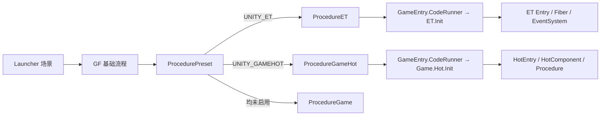

# 项目结构与模式选择

GDK 的核心不是把 ET 与 GF 强行绑定，而是用稳定加载层隔离不同业务模式。启动时只进入一个客户端分支；热更新开关再决定业务代码来自 Unity 程序集还是 DLL 资源。

## 总体启动链路



分支选择发生在 `ProcedurePreset`。ET 与 GameHot 都通过 CodeRunner 启动，但各自拥有独立加载器、程序集与业务生命周期。

## 根目录

| 目录 | 职责 |
| --- | --- |
| `Unity/` | Unity 客户端、编辑器工具、资源和 ET Unity 集成 |
| `DotNet/` | ET 独立服务端程序集 |
| `Share/` | 客户端与服务端共用的分析器、生成器、Aspire、文件服务器和工具 |
| `Design/` | Excel、Proto 等源数据 |
| `Config/` | 导出给独立服务端读取的 Luban 数据 |
| `Tools/` | Luban、模板与辅助脚本 |
| `Book/` | 面向开发者的专题文档 |
| `Bin/` | .NET 构建产物，已被 Git 忽略 |
| `Temp/` | 资源、安装包和中间构建产物，已被 Git 忽略 |

## 三个解决方案

| 解决方案 | 内容 | 主要用途 |
| --- | --- | --- |
| `Kit.sln` | DotNet + Share | 构建工具、服务端和文件服务器 |
| `DotNet/DotNet.sln` | 仅 DotNet | 专注独立服务端开发 |
| `Unity/Unity.sln` | Unity 生成项目 | 客户端、Loader、业务程序集和编辑器代码 |

Unity 解决方案由 Unity 生成，不应手工维护项目引用。共享的 Roslyn Analyzer 与 Source Generator 由 `Kit.sln` 构建后供 Unity 使用。

## Unity 业务分层

```text
Unity/Assets/Scripts/Game/
├── Procedure/        # GF 总入口流程，负责选择业务模式
├── Editor/           # 全局编辑器工具、构建、宏与 Toolbar
├── Generate/         # 非热更公共生成代码
├── ET/
│   ├── Loader/       # 稳定加载层与 GF 集成，不作为业务热更 DLL
│   ├── Editor/       # ET 编辑器工具
│   └── Code/         # Model/Hotfix/ModelView/HotfixView 业务程序集
└── Hot/
    ├── Loader/       # 稳定加载层
    └── Code/         # Game.Hot.Code 热更新业务程序集
```

`Loader/` 负责“如何加载”；`Code/` 负责“加载后做什么”。需要频繁迭代的业务代码放在 `Code/`，启动桥接、资源加载和程序集装载逻辑放在 `Loader/`。

## 模式矩阵

| 业务模式 | 入口 | 业务程序集 | 典型开发方式 |
| --- | --- | --- | --- |
| 纯 GF | `ProcedureGame` | `Game` | GF Procedure、UI、Entity |
| GameHot | `Game.Hot.Init` | `Game.Hot.Code` | MonoBehaviour + GF 扩展 |
| ET | `ET.Init` | Model、Hotfix、ModelView、HotfixView | Entity + System + Fiber |

GameHot 与 ET 的启用符号互斥。菜单实现会在启用一个模块时移除另一个模块，避免两个业务入口同时进入资源收集和裁剪配置。

## 热更新与非热更新

### 未启用 `UNITY_HOTFIX`

业务程序集由 Unity 正常编译并随 Player 发布。CodeRunner 从当前 AppDomain 查找入口，调试体验最直接。

### 启用 `UNITY_HOTFIX`

ET 或 GameHot 编译工具将业务程序集复制为 `.dll.bytes` 与 `.pdb.bytes` 资源。Loader 从 GF Resource 加载字节，再通过 `Assembly.Load` 启动业务入口。

HybridCLR 同时维护热更新程序集列表与 AOT 补充元数据。完整流程见 [HybridCLR 热更新](HybridCLR热更.md)。

## ET 程序集边界

| 程序集 | 内容 | 是否包含 Unity 视图 |
| --- | --- | --- |
| `Game.ET.Code.Model` | 客户端/服务端共享或纯逻辑数据 | 否 |
| `Game.ET.Code.Hotfix` | 业务 System 与热更新逻辑 | 否 |
| `Game.ET.Code.ModelView` | 客户端视图模型与 Mono 绑定 | 是 |
| `Game.ET.Code.HotfixView` | 客户端视图 System | 是 |

ET 的 `CodeMode` 决定客户端、服务端或两者的程序集内容。它由 `UNITY_ET_CODEMODE_CLIENT`、`SERVER`、`CLIENTSERVER` 三个互斥符号控制。

## 如何选择目录

| 需求 | 推荐位置 |
| --- | --- |
| GF 公共启动或基础能力 | `Game/` 对应模块 |
| GameHot 可热更业务 | `Game/Hot/Code/` |
| GameHot 稳定加载桥接 | `Game/Hot/Loader/` |
| ET 无视图 Entity 数据 | `Game/ET/Code/Model/` |
| ET 无视图 System 逻辑 | `Game/ET/Code/Hotfix/` |
| ET 客户端 View/Mono | `Game/ET/Code/ModelView/` |
| ET 客户端 View System | `Game/ET/Code/HotfixView/` |
| ET 与 GF 的适配层 | `Game/ET/Loader/UGF/` |
| 自动生成代码 | 对应 `Generate/`，不要手改 |

## 模式切换会修改什么

执行 `Game/Define Symbol` 下的菜单后，工具会处理：

1. 增删 Scripting Define Symbol。
2. 切换 ET 或 GameHot 的 `luban.conf.active`。
3. 激活对应 Resource Rule 配置。
4. 更新 `link.xml` 的条件区块。
5. 更新 HybridCLR 热更新程序集与 AOT 程序集列表。
6. 清理旧的临时 DLL 构建目录。

切换完成后应等待 Unity 编译，再重新导表。若手工修改宏而不执行菜单，以上关联配置不会自动同步。

## 关键入口

| 作用 | 文件 |
| --- | --- |
| 客户端分支选择 | `Unity/Assets/Scripts/Game/Procedure/ProcedurePreset.cs` |
| ET Unity 启动 | `Unity/Assets/Scripts/Game/ET/Loader/Init.cs` |
| ET 程序集加载 | `Unity/Assets/Scripts/Game/ET/Loader/CodeLoader.cs` |
| GameHot Unity 启动 | `Unity/Assets/Scripts/Game/Hot/Loader/Init.cs` |
| GameHot 业务入口 | `Unity/Assets/Scripts/Game/Hot/Code/Base/HotEntry.cs` |
| 模式开关 | `Unity/Assets/Scripts/Game/Editor/DefineSymbol/DefineSymbolTool.cs` |
| 裁剪配置 | `Unity/Assets/link.xml` |
