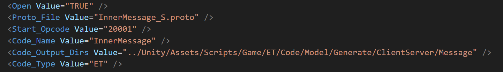

# Proto生成工具

## 说明

1.采用子目录分组生成，可以分别设置导出目录

2.子目录里必须有proto.conf文件才会识别该目录的proto文件生成代码

3.proto.conf参数说明

  - active -- 是否启用
  - startOpcode -- opcode开始数值
  - codeName -- 生成代码的类名
  - codeType -- 生成的代码类型，目前支持了ET，UGF（GF使用），需要可以自定义添加扩展
  - nameSpace -- 生成的代码的命名空间
  - codeOutputDirs -- 生成代码目录，可以填多个

3.执行proto2cs.bat（需要编译Kit.sln）