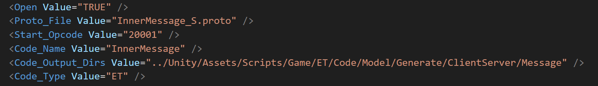

# Proto 生成工具

GDK 的 Proto2CS 是面向项目约定的轻量代码生成器，不调用 `protoc`。它按子目录隔离 Opcode 区间，并可生成 ET 的 MemoryPack 消息或 UGF 的 protobuf-net Packet。

## 目录约定

工具扫描 `Design/Proto/` 的直接子目录。每个启用目录必须包含 `proto.conf`，目录内的 `.proto` 会递归查找并按路径排序后生成。

当前配置：

| 目录 | codeType | startOpcode | 输出 |
| --- | --- | --- | --- |
| `ET-Client` | ET | 10000 | ET Client 与 ClientServer |
| `ET-ClientServer` | ET | 20000 | ET ClientServer |
| `GameHot` | UGF | 30000 | GameHot Message |

## 前置条件与执行

先构建工具：

```powershell
dotnet build Kit.sln
```

然后使用 Unity 菜单 `Game/Tool/Proto2CS`，或执行：

```powershell
Design/Proto/proto2cs.bat
```

命令行方式：

```powershell
Push-Location Bin
./Tool.exe --AppType=Proto2CS --Console=1
Pop-Location
```

## `proto.conf`

```json
{
  "active": true,
  "startOpcode": 10000,
  "codeName": "Message_ET_Client",
  "codeType": "ET",
  "nameSpace": "ET",
  "codeOutputDirs": [
    "%UNITY_ASSETS%/Scripts/Game/ET/Code/Model/Generate/Client/Message"
  ]
}
```

| 字段 | 说明 |
| --- | --- |
| `active` | 是否生成当前目录 |
| `startOpcode` | 该组的起始基值；第一条消息使用 `startOpcode + 1` |
| `codeName` | 主消息类文件名与 Opcode 容器名 |
| `codeType` | `ET` 或 `UGF`，不区分大小写 |
| `nameSpace` | 生成代码命名空间 |
| `codeOutputDirs` | 一个或多个输出目录 |

支持 `%CONF_ROOT%`、`%UNITY_ASSETS%`、`%ROOT%` 三个路径变量。多个输出目录会各写一份相同代码，适合客户端与 ClientServer 共享协议。

## Opcode 规则

生成器按已排序的 Proto 文件和文件内消息顺序递增 Opcode。插入或移动消息可能改变后续编号，因此已经上线的协议不应随意重排。

ET Core 当前约定：

| 区间 | 用途 |
| --- | --- |
| 10001–20000 | 外网消息 |
| 20001–40000 | 内网消息 |
| 40001–60000 | 项目扩展空间 |

生成器的硬上限是 60000。不同 `proto.conf` 的区间由开发者负责避免重叠。

## ET 输出

`codeType=ET` 会生成：

```text
<codeName>.cs
<codeName>_Id.cs
```

消息继承 `MessageObject`，添加 `MemoryPackable`、`Message` 和可选的 `ResponseType` 特性，并生成对象池 `Create` 与 `Dispose` 代码。

### 请求与响应

在请求前用注释声明响应类型：

```proto
// ResponseType G2C_Login
message C2G_Login // IRequest
{
    string Account = 1;
}
```

`// IRequest`、`// IActorRequest` 等尾注释会成为生成类的接口或父类型。Actor 消息接口由 ET 运行时处理。

在消息结束行添加 `// no dispose` 可阻止自动生成 Dispose，适用于需要自行管理回收逻辑的特殊消息。

## UGF 输出

`codeType=UGF` 会生成：

```text
<codeName>.cs
<codeName>Id.cs
<codeName>_PacketHandler.cs
```

名称以 `CS` 开头的消息继承 `CSPacketBase`，以 `SC` 开头的消息继承 `SCPacketBase`，并分配 Opcode。其他消息作为 `IReference` 数据对象，不分配 Packet Opcode。

生成器使用 protobuf-net 的 `ProtoContract` 与 `ProtoMember`。每个 `SC*` Packet 还会生成 Handler partial，业务代码可实现其 `OnHandle` 部分。

## 支持的 Proto 写法

这是行解析器，不支持完整 Proto 语法。当前支持：

- `message`、`enum`
- 基础字段
- `repeated`
- `map<K,V>`
- 行注释与项目自定义尾注释

推荐每行只写一个声明，并把 ET 消息的 `{`、`}` 独立成行：

```proto
message C2G_Ping // IRequest
{
    int64 Time = 1;
    repeated int32 Values = 2;
    map<string, int32> Scores = 3;
}
```

不要使用生成器未处理的 `package`、`import`、`oneof`、`optional` 或复杂 option。需要这些能力时，应扩展解析器或改用标准 protoc 流程。

## 类型映射

| Proto | C# |
| --- | --- |
| `int16` | `short` |
| `int32` | `int` |
| `int64` / `long` | `long` |
| `uint16` | `ushort` |
| `uint32` | `uint` |
| `uint64` | `ulong` |
| `bytes` | `byte[]` |

其他类型名按原样写入，通常用于同组消息或枚举。

## 生成稳定性

生成器只有内容变化时才重写主代码文件，避免无意义 diff。输出目录中失去对应源文件的空 `.meta` 会在生成末尾清理。

不要手工编辑生成文件。扩展行为应修改 `Share/Tool/Proto2CS/Proto2CS.ET.cs` 或 `Proto2CS.UGF.cs`。

## 常见问题

### 提示没有任何 `proto.conf`

确认配置位于 `Design/Proto` 的直接子目录，并且至少一个配置 `active=true`。

### Opcode 重复

检查不同目录的区间是否重叠。`startOpcode` 不是第一条消息的最终值，第一条会先加一。

### 某条字段解析失败

把声明整理为“一行一个字段”，使用受支持的类型和 `name = number;` 形式，再查看日志中的文件与行号。

### UGF 消息没有生成 PacketId

只有以 `CS` 或 `SC` 开头且未显式指定其他父类的消息会被识别为 Packet。

### 新增 codeType

实现新的生成器分支，并在 `Proto2CS.Export()` 的 `codeType` 分派中注册。未知类型会直接抛出错误，不会静默跳过。



## 关键代码

| 作用 | 文件 |
| --- | --- |
| 配置发现与分派 | `Share/Tool/Proto2CS/Proto2CS.cs` |
| ET 生成器 | `Share/Tool/Proto2CS/Proto2CS.ET.cs` |
| UGF 生成器 | `Share/Tool/Proto2CS/Proto2CS.UGF.cs` |
| Opcode 边界 | `Unity/Assets/Scripts/Library/ET/Core/Runtime/Network/OpcodeRangeDefine.cs` |
