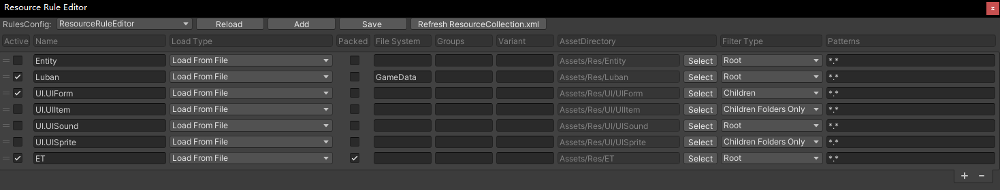

# 一键打包测试

## 方便出包，制作热更资源，进行测试

1. Unity菜单Game Framework/Resource Tools/Resource Rule Editor设置资源收集规则，[参考详细说明](https://github.com/northWolf/GameFramework.ResourceRuleEditor)

2. Unity菜单Game/Build Tool Editor打开打包工具界面

3. 点击Build Pkg按钮打包，该操作会自动打AssetBundle

4. 打出来的包在Temp目录下，点击Open Pkg Folder按钮可以打开打包的目录

5. Unity菜单Game/Tool/StartFileServer启动资源服务器（需要编译Kit.sln才可以，点击Game/Build Tool Editor界面中Build Kit.sln按钮或ide打开Kit.sln编译）

6. 运行即可以使用资源热更