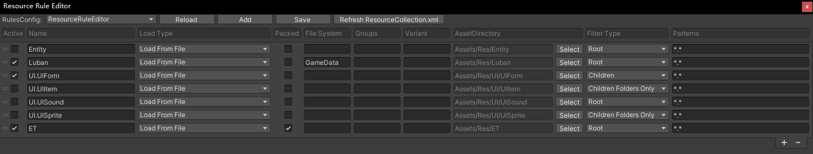

# 一键打包与本地资源更新

`Game/Build Tool Editor` 统一封装资源收集、AssetBundle 构建、Player 构建、资源刷新和本地测试目录。它读取 Launcher 的资源模式，不要求开发者重复配置 ResourceBuilder 的输出开关。

## 前置检查

1. Unity 已切换到目标 Build Target。
2. 当前业务模块、ET CodeMode 与 Hotfix 开关正确。
3. `dotnet build Kit.sln` 已成功。
4. Luban 与 Proto 已重新生成。
5. Hotfix 构建已执行 `HybridCLR/Do All`。
6. Resource Rule 已覆盖新增资源。

构建 Player 前应先在 Editor Resource Mode 下运行一次 Launcher，排除业务初始化错误。

## 资源收集规则

打开：

```text
Game Framework/Resource Tools/Resource Rule Editor
```

模式切换会激活 ET 或 GameHot 的规则配置，但新增资源目录仍需开发者确认。点击刷新生成 ResourceCollection 后，检查 UI、Entity、Luban、HybridCLR 与业务 Code 是否进入正确资源组。



## Build Tool 按钮

### Build Pkg (Contains Rebuild Resource)

完整构建入口：

1. 切换目标平台。
2. 清理 `Temp/Pkg/<Platform>`。
3. 刷新优化后的 ResourceCollection。
4. 构建资源。
5. 仅以 `Assets/Launcher.unity` 构建 Player。
6. 成功后打开输出目录。

输出文件名使用 `Application.productName`，Windows 自动添加 `.exe`，Android 添加 `.apk`。

### Build Resource With Refresh Optimize Collection

只刷新资源收集并构建资源，不构建 Player。适合资源迭代、生成热更新内容或验证 ResourceBuilder 配置。

### Build And Refresh Windows64 Pkg Resource

重新构建 Windows64 资源，并替换现有包中的：

```text
Temp/Pkg/Windows64/<ProductName>_Data/StreamingAssets/
```

该按钮要求 Windows64 包已经存在。它不会重新编译 Player 代码，脚本或场景清单变化时应重新 Build Pkg。

### Open Pkg Folder

打开当前平台的 `Temp/Pkg/<Platform>`。目录不存在时只记录错误，不触发构建。

### Build Kit.sln

在仓库根目录执行 `dotnet build`，更新 `Bin/` 中的 Tool、FileServer 与服务端程序集。

## 资源模式

构建工具从 `Unity/Assets/Res/GameEntry.prefab` 读取 `m_ResourceMode`。

| ResourceMode | ResourceBuilder 输出 | 运行方式 |
| --- | --- | --- |
| `Package` | Package | 资源随包发布，不检查远端版本 |
| `Updatable` | Full + Packed | 启动时检查并更新资源 |
| `UpdatableWhilePlaying` | Full + Packed | 资源可在使用时下载 |

当前 prefab 配置为 `Package`。修改资源模式后，下一次 BuildResource 会自动切换 ResourceBuilder 的输出选择。

ResourceBuilder 的 OutputDirectory 必须是 `../Temp/Bundle`。代码检测到其他目录会停止构建，避免本地服务器与刷新按钮找不到产物。

## 输出目录

| 目录 | 内容 |
| --- | --- |
| `Temp/Bundle` | ResourceBuilder 的 Package、Full、Packed 与报告 |
| `Temp/Pkg/<Platform>` | Player 或平台工程 |
| `Temp/Version` | 本地可更新模式的版本信息文件 |
| `Unity/Assets/StreamingAssets` | 构建期间使用的包内资源，仓库忽略其内容 |

`BuildHelper.BuildPkg` 每次会清理目标平台的 Pkg 目录。需要保留历史包时，应在构建前复制到仓库外部。

## 本地资源服务器

先构建 `Kit.sln`，再选择：

```text
Game/Tool/StartFileServer
```

菜单从 `Bin/` 启动：

```powershell
dotnet FileServer.dll
```

默认监听 `http://*:8088`。本地版本信息使用 `http://127.0.0.1:8088` 作为更新前缀。

服务器按顺序查找：

```text
Temp/Bundle/Full
Temp/Version
Temp/Pkg/WebGL
Bundle
Version
```

这是开发服务器，没有鉴权，并监听所有网卡。只应在可信开发网络使用；对外发布应使用正式对象存储、CDN 与版本服务。

## 本地热更新测试

1. 将 ResourceMode 切为 `Updatable` 或 `UpdatableWhilePlaying`。
2. 执行 Build Pkg，得到基础包与首版资源。
3. 修改资源或热更新 DLL。
4. 必要时重新执行 `HybridCLR/Do All`。
5. 点击 `Build Resource With Refresh Optimize Collection`。
6. 启动 FileServer。
7. 运行 `Temp/Pkg/<Platform>` 中的 Player。

构建事件会把 `<Platform>Version.txt` 写入 `Temp/Version`，Player 先读取版本信息，再从 UpdatePrefixUri 下载资源。

## 支持平台

Build Tool 当前映射：Windows、Windows64、Android、iOS、macOS、Linux、WebGL。实际能否构建仍取决于 Unity 是否安装对应平台模块和本机工具链。

切换平台可能触发长时间资源重导入。窗口会先显示确认对话框；取消后不会继续构建。

## 常见问题

### Resource mode is invalid

检查 `GameEntry.prefab` 的 ResourceComponent，不能使用 `Unspecified`。

### OutputDirectory 不匹配

打开 GF Resource Builder 配置，把 Output Directory 设为 `../Temp/Bundle`。该路径是本项目构建与文件服务器的共同约定。

### 构建成功但运行时找不到 DLL

确认 Resource Rule 包含 `Assets/Res/ET/Code` 或 `Assets/Res/Hot/Code`，Hotfix 模式还要包含 `Assets/Res/HybridCLR`，然后重新构建资源。

### 本地更新请求 404

检查 FileServer 是否从 `Bin/` 启动、端口 8088 是否占用，以及目标文件是否位于它配置的五个根目录之一。

### Windows64 Refresh 按钮报目录不存在

先执行一次 Windows64 Build Pkg。Refresh 只更新已有包中的 StreamingAssets，不创建 Player。

### BuildLog 在哪里

ResourceBuilder 失败日志路径会以可点击链接输出到 Unity Console。优先查看最早的资源收集或压缩错误。

## 关键代码

| 作用 | 文件 |
| --- | --- |
| Build Tool 窗口 | `Game/Editor/Build/BuildToolEditor.cs` |
| Player 构建 | `Game/Editor/Build/BuildHelper.cs` |
| ResourceBuilder 封装 | `Library/UGF/UnityGameFramework.Extension/Editor/Resource/ResourceBuildHelper.cs` |
| 版本信息生成 | `Game/Editor/Build/UGFBuildEvent.cs` |
| 文件服务器配置 | `Share/FileServer/Config.cs` |
