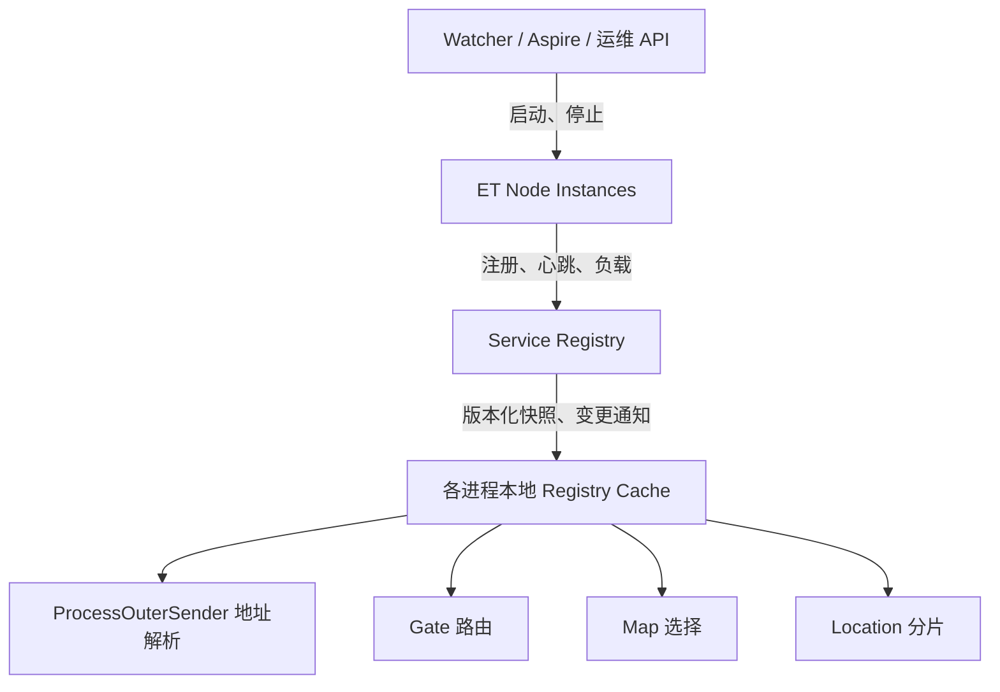

# ET 动态扩容设计（未实现）

> 状态：架构提案。当前仓库尚未实现 ServiceRegistry、动态端口、运行时 Scene 增删、Gate 一致性哈希、Map 自动伸缩或 Location 分片。本篇不是现成功能的使用手册。

本文先记录代码已经具备的静态拓扑，再定义动态扩容的目标、约束、分阶段改造和验收条件。任何阶段落地后，都应同步更新状态与代码链接。

## 1. 当前实现

### 1.1 静态配置

服务端拓扑来自四张 Luban 表：

| 表 | 当前关键字段 | 作用 |
| --- | --- | --- |
| `StartMachineConfig` | Id、InnerIP、OuterIP、WatcherPort | 物理机与 Watcher |
| `StartProcessConfig` | Id、MachineId、Port | 进程归属与内网端口 |
| `StartSceneConfig` | Id、Process、Zone、SceneType、Name、Port | Scene 与外网端口 |
| `StartZoneConfig` | Id、DBConnection、DBName | Zone 数据库 |

`DTStartSceneConfig.PostInit()` 在加载后构建 Gates、Maps、Realms、ProcessScenes、LocationConfig 等内存索引。

### 1.2 启动链路

```text
Excel 静态配置
  → Luban 导出 Config/Luban
  → Watcher 或 Aspire 读取 Process 列表
  → App.dll --Process=<Id>
  → EntryEvent2_InitServer 按 Process 创建全部 Scene Fiber
```

Watcher 根据 Machine.InnerIP 启动本机所有 Process。Aspire 当前同样遍历 `DTStartProcessConfig`，每个 Process 的 `replicasNum` 固定为 1。

### 1.3 地址解析

`ProcessOuterSender.Get(channelId)` 把 `channelId` 当作 ProcessId，直接从 `DTStartProcessConfig` 读取 IPEndPoint 并创建 Session。

因此当前约束是：

- ProcessId 必须在集群内唯一。
- Process 地址在进程启动后不可变化。
- 所有进程必须持有完全一致的静态配置。
- 同一个 ProcessId 不能直接启动多个副本。

### 1.4 当前路由

| 场景 | 当前行为 | 限制 |
| --- | --- | --- |
| Gate | `hash % gateCount` | 节点数变化会大面积重新映射 |
| Map | 按 SceneName 查静态配置 | 没有负载与健康状态 |
| Location | 固定 `LocationConfig.ActorId` | 单实例、无分片 |
| 跨进程 Actor | ActorId.Process 查静态地址 | 地址不可动态更新 |

### 1.5 ActorId

当前 `ActorId` 是 16 字节：

```text
Address.Process  int   4 bytes
Address.Fiber    int   4 bytes
InstanceId       long  8 bytes
```

它直接编码 ProcessId，是现有本地/跨进程路由判断的一部分。

## 2. 为什么当前不能直接扩容

仅把 Aspire 的 `replicasNum` 从 1 改大并不成立：多个副本会共享 ProcessId、端口和 SceneId，导致监听冲突、Session 路由冲突与 ActorId 冲突。

动态扩容至少需要同时解决：

1. 每个运行实例的唯一身份。
2. 运行时地址注册与过期。
3. Scene 运行实例的唯一身份和归属。
4. 地址与路由变更的版本一致性。
5. 节点下线前的停止接流与状态迁移。

## 3. 目标与非目标

### 3.1 目标

- 在不重启整个集群的情况下增加或移除 Gate、Map、Location 实例。
- 跨进程发送不再依赖静态 IP/Port 查表。
- 新请求只路由到健康且 Ready 的实例。
- 节点可进入 Draining，停止接收新流量后再退出。
- 配置仍能描述本地开发的初始拓扑。
- 每个阶段都可独立回滚到静态拓扑。

### 3.2 第一阶段非目标

- 不立即实现 CPU/内存驱动的自动扩缩容策略。
- 不修改 ActorId 二进制格式。
- 不承诺跨机房容灾或多活 Registry。
- 不在第一阶段迁移 Location 的持久状态。
- 不让业务消息路径同步访问远程 Registry。

先完成可靠的“人工增删节点 + 服务发现”，再叠加自动化策略。

## 4. 统一术语

| 术语 | 定义 |
| --- | --- |
| Process Template | 配置表中的启动模板，不代表具体运行副本 |
| Node Instance | 一次实际启动的 App.dll 进程，拥有唯一 NodeInstanceId 与 ProcessId |
| Scene Instance | 一个实际运行的 Scene Fiber，拥有唯一 SceneId |
| Registry | 保存节点、Scene、租约和路由快照的服务 |
| Route Snapshot | 带版本号的只读地址与路由视图 |

必须区分“配置模板”和“运行实例”。原方案只增加 Count，但没有定义新增实例如何获得唯一 ProcessId、SceneId 和端口。

## 5. 目标架构



Registry 是控制面；业务消息仍在 ET 节点之间直连。消息热路径只读本地缓存，不把 Registry 变成数据面代理。

## 6. 运行实例身份

### 6.1 ProcessId 必须唯一

当前 `channelId`、ActorId.Process 与 Session 子实体 Id 都依赖 ProcessId。任何并行存活的 Node Instance 都必须拥有不同 ProcessId。

不能用“相同 ProcessId + ReplicaIndex”直接复制现有进程，除非先重写所有使用 ProcessId 的路由与标识逻辑。

### 6.2 ID 分配选项

| 方案 | 优点 | 缺点 |
| --- | --- | --- |
| Aspire 预分配 | 启动参数明确，调试简单 | 多个编排器需要协调 |
| Registry 租约分配 | 集中保证唯一 | 启动依赖 Registry，需处理租约恢复 |
| 分段 ID | 多编排器可独立工作 | 配置和容量规划更复杂 |

建议第一阶段由单一编排器预分配 ProcessId 与 SceneId，Registry 负责冲突校验。稳定后再评估租约分配。

### 6.3 建议注册模型

```text
NodeRecord
  NodeInstanceId
  ProcessId
  MachineId
  InnerEndpoint
  State
  LeaseExpiresAt
  Revision

SceneRecord
  SceneId
  ProcessId
  Zone
  SceneType
  Name
  State
  Load
  Revision
```

`NodeInstanceId` 标识一次进程生命周期；ProcessId 仍用于兼容 Actor 路由。进程重启可以复用 ProcessId，但必须生成新的 NodeInstanceId，防止旧心跳覆盖新实例。

## 7. 节点状态机

```text
Starting → Ready → Draining → Offline
    │         │          │
    └─────────┴──────────→ Failed
```

| 状态 | 路由行为 |
| --- | --- |
| `Starting` | 已注册，但不接收业务流量 |
| `Ready` | 可被新请求选中 |
| `Draining` | 保留已有会话，不接收新流量 |
| `Offline` | 正常注销，不再出现在快照 |
| `Failed` | 租约过期或健康检查失败 |

Registry 根据心跳更新租约。节点异常退出后，必须等租约过期才标记 Failed；超时时间过短会误判 GC 或网络抖动，过长会延迟故障摘除。

## 8. 节点启动流程

1. 编排器分配 ProcessId、Scene 描述和 RegistryAddress。
2. Node 启动内网服务并获得实际 Endpoint。
3. Node 以 `Starting` 注册 NodeRecord。
4. Node 拉取完整 Route Snapshot。
5. Node 创建本地 Scene Fiber，并逐个注册 SceneRecord。
6. 所有必需 Scene 就绪后，把 Node 与 Scene 标记为 `Ready`。
7. Node 定期发送心跳与负载。

失败节点必须在 Ready 前保持不可路由。不能先发布地址，再异步初始化数据库、Scene 或消息处理器。

## 9. Registry 地址与可用性

第一阶段允许 Registry 使用固定地址，并由 Watcher/Aspire 通过环境变量或启动参数传给所有节点：

```text
--RegistryAddress=127.0.0.1:20000
```

该参数尚未存在于当前 `Options`，落地前必须增加并覆盖命令行解析测试。

固定单节点 Registry 适合开发验证，但仍是控制面单点。生产化前至少需要：

- Registry 重启后的状态恢复策略。
- 节点在 Registry 短暂不可用时继续使用最后快照。
- 快照过期上限与降级行为。
- 主从、共识存储或外部注册中心的选型。

业务节点不应因一次 Registry 请求失败立即退出，也不能无限使用过期路由。

## 10. 地址缓存与 ProcessOuterSender

### 10.1 当前代码

```csharp
IPEndPoint endpoint = Tables.Instance.DTStartProcessConfig
    .Get(Options.Instance.StartConfig, processId)
    .IPEndPoint;
```

### 10.2 目标行为

`ProcessOuterSender` 从本地 `RegistryCache` 查询 ProcessId 对应 Endpoint。缓存以快照版本原子替换，读路径不加远程网络调用。

```text
Send Actor Message
  → RegistryCache.TryGetProcess(processId)
  → 获取或创建 Session
  → 直接发送
```

同步 `Get()` 中不能“缓存未命中时同步请求 Registry”。这会阻塞 Fiber，并把控制面延迟带入所有业务 RPC。

缓存未命中可选择：

1. 返回明确的 RouteNotReady，由上层异步重试。
2. 把消息放入有界等待队列，异步刷新后继续。
3. 在创建 Actor 引用前先调用异步 EnsureRoute。

第一阶段建议使用明确错误 + 有界重试，避免隐藏的无限队列。

### 10.3 地址变化

快照更新发现 Endpoint 变化时，应关闭旧 Session，再按需连接新地址。必须用 NodeInstanceId 或 Revision 防止旧通知回滚新地址。

## 11. 动态端口

原方案要求节点绑定端口 0，由 OS 分配端口后注册。落地前需验证当前 TCP/KCP Service 能否可靠读回实际绑定 Endpoint，并覆盖 Windows、Linux 与容器网络。

建议分两步：

1. Registry 先支持运行时注册地址，但仍使用配置端口。
2. 完成网络层验证后，再删除 Process/Scene 的静态 Port。

这样服务发现与端口分配解耦，首个可用版本不必同时修改配置、网络、启动与路由。

## 12. 配置演进

配置表在第一阶段仍描述初始拓扑，不直接代表运行态真相。

### 12.1 最小改造

| 表 | 第一阶段建议 |
| --- | --- |
| Machine | 暂时保留；移除 Watcher 后再删除 WatcherPort |
| Process | 保留模板、MachineId 和 Port；新增期望副本数需明确 ID 分配 |
| Scene | 保留模板；可新增 Count，但展开规则必须生成唯一 SceneId |
| Zone | 保持不变 |

`Process=0 表示自动分配` 只有在编排器实现确定性 Placement 后才能启用。否则相同配置在不同启动次序下会产生不同拓扑。

### 12.2 运行态来源

| 数据 | 权威来源 |
| --- | --- |
| 期望初始拓扑 | Luban 配置 |
| 实际存活节点 | Registry 租约 |
| 实际 Scene | Registry SceneRecord |
| 当前地址 | Registry Route Snapshot |
| 当前负载 | 节点心跳 |

Registry 不应反向修改 Excel。运行态与设计态通过编排器协调。

## 13. Aspire 改造约束

当前 `Share/Aspire/Program.cs` 已读取静态配置并启动 App.dll，但存在落地前必须处理的差距：

- `replicasNum` 固定为 1。
- 多副本没有唯一 ProcessId 与 SceneId 分配。
- 传入了 `ReplicaIndex`、`SceneName`、`SingleThread`，当前 `Options` 未声明这些参数。
- 环境变量中的动态 IP/Port 尚未被 ET 网络初始化读取。
- 没有 Ready、Draining、租约或停止 API。

第一阶段应先让 Aspire 只使用运行时确实支持的参数，并为每个参数写启动集成测试。

## 14. Gate 扩缩容

当前 Gate 选择是：

```csharp
zoneGates[(int)(hash % (ulong)zoneGates.Count)]
```

节点数变化会改变大部分账号的结果。目标可以使用一致性哈希或 Rendezvous Hash，但只用于“新登录选择”。

已有客户端已连接某个 Gate，不能因为哈希环变化强制迁移。Gate 下线流程应为：

1. 标记 Draining，停止分配新登录。
2. 保持已有 Session 直到自然退出或达到最大等待时间。
3. 必要时执行明确的重连协议。
4. Session 清空后注销并停止进程。

一致性哈希降低新请求映射变化，不等于自动迁移现有长连接。

## 15. Map 扩缩容

Map 选择需要同时考虑 SceneType、Zone、地图模板、状态和负载。

建议负载指标至少包含：

- 玩家数量与容量上限。
- 最近一段时间的消息队列长度。
- Tick 或 Fiber 更新时间。
- 是否处于 Ready/Draining。

扩容流程：

1. 编排器启动新 Node/Scene。
2. 新 Map 完成资源、配置与数据库初始化。
3. 标记 Ready。
4. 新进入玩家才可能被分配到该实例。

缩容流程：

1. Map 标记 Draining。
2. 停止分配新玩家。
3. 等待自然离开，或用 TransferHelper 迁移。
4. 确认 Location 与持久化状态已更新。
5. 注销 Scene，再停止 Node。

自动伸缩阈值、冷却时间和最大实例数属于后续策略层，不应写死在 Registry 核心。

## 16. Location 分片

Location 保存 Key 到 ActorId 的映射，扩缩容不仅是路由变更，还涉及状态所有权迁移。

第一步可固定 N 个分片，并使用稳定哈希选择分片：

```text
shard = Hash(type, key) → Location Scene
```

动态改变分片数前必须设计：

- 旧分片到新分片的数据迁移。
- 迁移期间读写的一致性。
- Lock/UnLock 操作的顺序保证。
- 节点失败后的恢复来源。
- 路由版本与状态版本的绑定。

在这些问题解决前，只实现固定分片，不支持运行时缩容。

## 17. ActorId 改造：暂缓

把 ActorId 从 16 字节缩成 8 字节不是动态扩容的前置条件。它会影响：

- Core Entity 与 EntityRef。
- MemoryPack/BSON 序列化兼容性。
- Actor 消息头与 ByteHelper。
- 数据库存量数据。
- 跨版本滚动升级。
- InstanceId 溢出与复用安全。

第一、二阶段保留当前 ActorId。服务发现仍以 ProcessId 兼容现有路由。

如果消息带宽分析证明 8 字节收益显著，应单独建立 RFC，包含基准、存量迁移、协议版本与灰度方案，不能作为扩容改造的顺手优化。

## 18. 实施阶段

### 阶段 0：验证与可观测性

- 为当前静态启动建立集成测试。
- 验证 Service 绑定端口 0 与 Endpoint 读回。
- 为 Process、Scene、Session 增加结构化日志和指标。
- 修正 Aspire 参数与 Options 不一致。

验收：静态拓扑行为有自动化基线，新增实例 ID 与端口方案通过跨平台实验。

### 阶段 1：Registry + 静态端口

- 实现 Node/Scene 注册、心跳、租约与版本快照。
- ProcessOuterSender 改读本地 RegistryCache。
- 端口仍来自现有配置。
- 编排器可人工启动一个额外的唯一 ProcessId。

验收：修改运行节点列表无需重启其他进程，地址缓存能正确新增、更新与摘除。

### 阶段 2：动态端口与优雅下线

- 节点绑定动态端口并注册实际 Endpoint。
- 实现 Ready/Draining/Offline。
- Session 对地址变更安全重连。
- Watcher/Aspire 提供停止与排空接口。

验收：端口不写入配置；节点能先停止接流，再无损退出。

### 阶段 3：Gate 路由

- Registry 发布 Ready Gate 列表。
- Realm 使用一致性哈希或 Rendezvous Hash。
- 只迁移新登录路由，保留已有 Session。

验收：增加 Gate 后无需重启 Realm；已有连接不被意外断开。

### 阶段 4：Map 与固定 Location 分片

- Map 上报负载并支持 Draining。
- 新玩家按容量与负载选择 Map。
- Location 使用固定数量分片。

验收：Map 可人工扩缩容；Location 在固定分片数下正确路由并通过一致性测试。

### 阶段 5：自动化策略与高可用

- 自动扩缩容控制器。
- Registry 高可用与状态恢复。
- Location 在线再分片。
- 滚动升级与版本兼容。

验收标准需在前四阶段的运行数据基础上制定。

## 19. 主要改造点

| 文件/模块 | 计划改动 |
| --- | --- |
| `Options.cs` | 增加受支持的 Registry、实例与编排参数 |
| `Share/Aspire/Program.cs` | 唯一 ID、生命周期、启动/停止与健康检查 |
| `EntryEvent2_InitServer.cs` | 从运行实例描述创建 Scene |
| `FiberInit_NetInner.cs` | 注册实际 Endpoint 与 Ready 状态 |
| `ProcessOuterSenderSystem.cs` | 从 RegistryCache 解析地址 |
| `DTStartSceneConfig` Partial | 只保留初始拓扑索引，不作为运行态真相 |
| `RealmGateAddressHelper.cs` | Ready Gate 路由与 Draining |
| `C2G_EnterMapHandler.cs` | Map 负载选择 |
| `LocationProxyComponentSystem.cs` | 固定分片路由，后续支持迁移 |
| 新增 Registry Server | 注册、租约、快照、订阅与冲突校验 |
| 新增 Registry Client | 本地缓存、版本处理与重连 |

文件名是建议，不表示当前已经存在。

## 20. 必须覆盖的故障场景

| 场景 | 期望行为 |
| --- | --- |
| Node 启动后未 Ready | 不进入路由快照 |
| Node 无心跳 | 租约过期后摘除 |
| Registry 短暂不可用 | 节点使用有限期最后快照 |
| 快照乱序到达 | 低 Revision 不覆盖高 Revision |
| Endpoint 变化 | 旧 Session 关闭，新消息使用新地址 |
| Draining 节点 | 不接收新流量，已有流量按策略完成 |
| 重复 ProcessId | Registry 拒绝第二个存活实例 |
| 编排器重复请求 | 启停操作保持幂等 |
| Map 迁移失败 | 保持旧所有权或执行可恢复回滚 |

## 21. 测试与验收

### 单元测试

- Registry 状态机与租约。
- Route Snapshot 版本比较。
- Gate 哈希稳定性。
- Map 选择过滤 Ready/Draining。
- Location 固定分片一致性。

### 集成测试

- 运行中增加、重启、移除 Node。
- Registry 重启与客户端缓存恢复。
- Endpoint 变化后的 Session 重建。
- Gate 扩容期间持续登录。
- Map Draining 期间持续转场。

### 压力测试

- Registry 心跳与订阅规模。
- 大量 ProcessOuterSender 缓存读取。
- 路由快照广播风暴。
- 节点批量失联后的恢复时间。

## 22. 落地前决策

以下问题没有答案前，不应开始大范围改 Actor 与配置代码：

1. ProcessId 由 Aspire 还是 Registry 分配？
2. Registry 首版使用 ET Scene 还是独立 ASP.NET 服务？
3. Route Snapshot 的一致性和过期上限是什么？
4. TCP、KCP 是否都支持动态端口读回？
5. Gate 下线是否允许强制客户端重连？
6. Map 状态迁移的权威来源是什么？
7. Location 首版是否只做固定分片？
8. 生产环境 Registry 的高可用方案是什么？

这些决策应形成 ADR，并在每个实施阶段保持可回滚边界。

## 代码依据

| 当前行为 | 文件 |
| --- | --- |
| Aspire 静态启动 | `Share/Aspire/Program.cs` |
| Process 创建 Scene | `Game/ET/Code/Hotfix/Server/Demo/EntryEvent2_InitServer.cs` |
| 静态地址解析 | `Game/ET/Code/Hotfix/Server/Module/Message/ProcessOuterSenderSystem.cs` |
| Gate 取模 | `Game/ET/Code/Hotfix/Server/Demo/Realm/RealmGateAddressHelper.cs` |
| Location 单例 | `Game/ET/Code/Hotfix/Server/Module/ActorLocation/LocationProxyComponentSystem.cs` |
| Scene 静态索引 | `Game/ET/Code/Model/Generate/ClientServer/LubanPartial/DTStartSceneConfig.cs` |
| ActorId 布局 | `Library/ET/Core/Runtime/World/ActorId.cs` |
