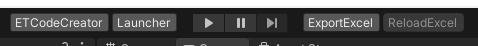

# 自定义 Toolbar

项目通过 `me.xw.toolbarextension` 把静态 IMGUI 方法注册到 Unity 主工具栏。业务代码只需添加 `[Toolbar]`，不需要修改 Unity 内部 Toolbar 类型。

## 最小示例

```csharp
using ToolbarExtension;
using UnityEditor;
using UnityEngine;

namespace Game.Editor
{
    internal static class BuildToolbar
    {
        private static readonly GUIContent s_Content =
            new("Build", "Open Build Tool");

        [Toolbar(OnGUISide.Right, 10)]
        private static void OnToolbarGUI()
        {
            if (GUILayout.Button(s_Content))
            {
                EditorApplication.ExecuteMenuItem("Game/Build Tool Editor");
            }
        }
    }
}
```

方法必须是静态、无参数。ToolbarHelper 通过 `methodInfo.Invoke(null, null)` 调用；实例方法或带参数方法会在编辑器初始化或绘制时失败。

## 特性参数

```csharp
[Toolbar(OnGUISide side, int priority)]
```

| 参数 | 说明 |
| --- | --- |
| `side` | `Left` 或 `Right` 工具栏区域 |
| `priority` | 同一区域内的排序权重 |

当前实现左侧按 priority 升序保存，右侧按 priority 降序保存。Unity 6000.3 的容器使用反向 Flex 布局，因此判断视觉位置时应以实际工具栏为准，不要依赖未记录的“越大越靠外”猜测。

## 当前项目按钮

| 按钮/控件 | Side | Priority | 作用 |
| --- | --- | --- | --- |
| 场景下拉框 | Left | -999 | 打开 `Assets/Res` 中的场景 |
| ET/GameHot 目录聚焦 | Left | -2 | 快速定位模块目录 |
| 公共目录聚焦 | Left | -1 | 快速定位常用目录 |
| `ETCompile` / `ETReload` | Left | 0 | 编译或重载 ET DLL |
| `HotCompile` | Left | 50 | 编译 GameHot DLL |
| `Launcher` | Left | 100 | 从 Launcher 场景进入播放 |
| Open 文件夹组 | Right | -1 | 打开 Excel、Proto、Build 目录 |
| `ReloadExcel` | Right | 98 | 播放中重载 ET 表 |
| `ExportExcel` | Right | 99 | 执行 ExcelExporter |

模块按钮受编译符号控制，不会在所有模式同时出现。



## Unity 版本适配

Unity `6000.3+` 使用 `UnityEditor.Toolbars.MainToolbarElement` 创建左右容器。更早版本通过 Toolbar 根 VisualElement 注册 IMGUIContainer。

版本差异由 Package 内部处理，业务 Toolbar 方法无需条件编译。升级 Unity 时应先验证 Package 对新 Toolbar API 的适配。

## 绘制建议

- 用静态只读 `GUIContent`，避免每帧分配。
- 耗时任务使用异步流程或启动外部进程，不要阻塞 OnGUI。
- 用 `EditorGUI.BeginDisabledGroup` 明确不可用状态。
- 按钮文本保持短小，把详细说明放在 Tooltip。
- 播放状态、编译状态和重复点击保护应在方法内部处理。

## 常见问题

### 按钮没有出现

确认脚本编译进 Editor 程序集、已引用 `ToolbarExtension`，并检查方法是否带 `[Toolbar]`。运行时代码程序集不能引用 UnityEditor。

### 点击时报 TargetException

方法不是 static，或签名带参数。改为静态无参方法。

### 顺序与预期相反

左右区域的排序方向不同，Unity 6000.3 还使用 RowReverse。调整 priority 后以实际显示为准，并避免多个按钮使用相同权重。

### 修改后没有刷新

Toolbar 方法在静态构造时扫描。等待脚本重载；仍未刷新时重开 Unity 编辑器。

## 关键代码

| 作用 | 文件 |
| --- | --- |
| 项目示例 | `Game/Editor/ToolBar/` |
| ET Toolbar | `Game/ET/Editor/ToolBar/` |
| GameHot Toolbar | `Game/Hot/Loader/Editor/ToolBar/` |
| Package 依赖 | `Unity/Packages/manifest.json` |

Package 源码来自 [ToolbarExtension](https://github.com/XuToWei/ToolbarExtension)。
