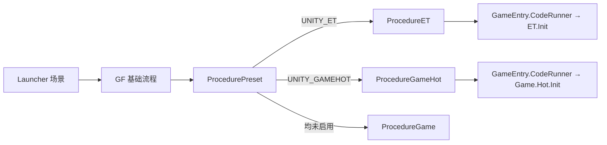

# 模块 01：总体架构与启动流程

## 概述
GDK 的核心是**用稳定加载层隔离不同业务模式**：启动时只进入一个客户端分支（ET / GameHot / 基础 Game），热更新开关再决定业务代码来自 Unity 程序集还是 DLL 资源。

## 根目录职责
| 目录 | 职责 |
| --- | --- |
| `Unity/` | Unity 客户端、编辑器工具、资源和 ET Unity 集成 |
| `DotNet/` | ET 独立服务端程序集（Kit.sln / DotNet.sln） |
| `Share/` | 客户端与服务端共用：Analyzer、SourceGenerator、Aspire、FileServer、Tool（ExcelExporter / Proto2CS） |
| `Design/` | Excel、Proto 等源数据 |
| `Config/` | 导出给独立服务端读取的 Luban 数据 |
| `Tools/` | Luban、cwRsync、RecastNavExportor 与辅助脚本 |
| `Book/` | 面向开发者的专题文档 |
| `Bin/` | .NET 构建产物（Git 忽略） |
| `Temp/` | 资源、安装包和中间产物（Git 忽略） |

## 三个解决方案
| 解决方案 | 内容 | 用途 |
| --- | --- | --- |
| `Kit.sln`（根） | DotNet + Share | 构建工具、服务端、文件服务器 |
| `DotNet/DotNet.sln` | 仅 DotNet | 专注独立服务端 |
| `Unity/Unity.sln` | Unity 生成项目 | 客户端、Loader、业务程序集与编辑器代码（不要手工维护） |

## 客户端启动链路


### 关键文件
| 作用 | 文件 |
| --- | --- |
| 分支选择 | `Game/Procedure/ProcedurePreset.cs` |
| GF 基础流程 | `Game/Procedure/ProcedureLaunch → Splash → CheckVersion → Init/Check/Complete/Update Resources → Verify → Preload → Game` |
| Unity 总入口 | `Game/Base/GameEntry.cs`（partial） |
| 内置组件 | `Game/Base/GameEntry.Builtin.cs`（Base/DataNode/Debugger/Event/UI/Scene/Entity/Sound/Localization/Resource/Procedure...） |
| 扩展组件 | `Game/Base/GameEntry.Extension.cs`（AssetSet/CodeRunner/NetworkService/Screen） |
| 游戏组件 | `Game/Base/GameEntry.Game.cs`（Builtin/Camera/Platform/Tables） |

### GameEntry 初始化顺序
```csharp
private void Start()
{
    InitBuiltinComponents();      // UGF 内置组件
    InitExtensionComponents();    // UGF Extension 组件
    InitGameComponents();         // 自定义游戏组件
    UnityGameFramework.Runtime.GameEntry.Initialize(); // 启动 GF
}
```

## ProcedurePreset 分支逻辑
```csharp
protected override void OnEnter(ProcedureOwner procedureOwner)
{
    // 给所有 ExButton 挂点击音效
    ExButton.AllButtonOnPointerDownEvent += PlayButtonClickSound;
#if UNITY_ET
    ChangeState<ProcedureET>(procedureOwner);
#elif UNITY_GAMEHOT
    ChangeState<ProcedureGameHot>(procedureOwner);
#else
    ChangeState<ProcedureGame>(procedureOwner);
#endif
}
```

## 模式矩阵
| 业务模式 | 入口 | 业务程序集 | 开发方式 |
| --- | --- | --- | --- |
| 纯 GF（GameHot） | `Game.Hot.Init` | `Game.Hot.Code` | GF + MonoBehaviour |
| ET | `ET.Init` | Model/Hotfix/ModelView/HotfixView | Entity + System + Fiber |

- `UNITY_ET` 与 `UNITY_GAMEHOT` 互斥；`UNITY_HOTFIX` 可叠加（业务转 DLL 资源）。
- 未启用 `UNITY_HOTFIX`：业务程序集随 Player 发布，CodeRunner 从 AppDomain 查找入口。
- 启用 `UNITY_HOTFIX`：业务程序集复制为 `.dll.bytes` 资源，Loader 从 GF Resource 加载后 `Assembly.Load`。

## 设计要点
- `Loader/` 负责"如何加载"，`Code/` 负责"加载后做什么"——频繁迭代代码放 `Code/`，启动桥接放 `Loader/`。
- 模式切换（Define Symbol 菜单）会同步：宏、`luban.conf.active`、资源规则、`link.xml`、HybridCLR 程序集列表、清理临时 DLL 目录。
- 官方文档：`Book/Project结构.md`、`Book/快速开始.md`。
