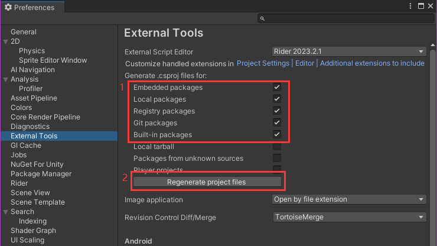

# GameDevelopmentKit的介绍：
努力提供完善的双端开发工具

服务端以[ET8.1框架](https://github.com/egametang/ET)为基础

客户端以[UnityGameFramework框架（GF）](https://github.com/EllanJiang/UnityGameFramework)为基础，将ET框架子模块化入GF，完善ET的客户端功能

配置工具使用[Luban](https://github.com/focus-creative-games/luban)

使用[HybridCLR](https://github.com/focus-creative-games/hybridclr)热更新

***

## 交流QQ群：949482664

# 细节

1.以[GFUI](Unity/Assets/Scripts/Game/ET/Loader/UGF/UIForm)为基础的[ETUI](Unity/Assets/Scripts/Game/ET/Code/ModelView/Client/Module/UGF)

2.以[GFEntity](Unity/Assets/Scripts/Game/ET/Loader/UGF/Entity)为基础的[ETEntity](Unity/Assets/Scripts/Game/ET/Code/ModelView/Client/Module/UGF)

3.使用极其灵活方便的[代码绑定工具](https://github.com/XuToWei/CodeBind)，解决代码与资源映射的最后一公里，极力推荐！

4.配置灵活易扩展的[状态控制器](https://github.com/XuToWei/StateController)，加上宏"STATE_CONTROLLER_CODE_BIND"即可代码绑定时自动生成状态数据的代码，一行代码就能控制繁琐的UI状态，极力推荐与[代码绑定工具](https://github.com/XuToWei/CodeBind)结合使用！

5.[模块切换](Book/Project%E7%BB%93%E6%9E%84.md)方便，ET逻辑或GF逻辑，热更或非热更选择随心所欲，当然也可以只用GF

6.项目全面使用[UniTask](https://github.com/Cysharp/UniTask)异步方案，已替换ETTask，对非ET的部分支持更全面，扩展支持了GF，推荐使用

7.[基于Luban优化过后的导表工具](Book/Luban%E9%85%8D%E7%BD%AE.md)，简化Luban使用步骤，可以灵活的修改导出配置，支持多线程导表速度大幅提升

8.完善的[多语言](Book/%E5%A4%9A%E8%AF%AD%E8%A8%80.md)支持，导表自动生成多语言配置，支持编辑器配置和预览

9.完善的[热更新](Book/HybridCLR%E7%83%AD%E6%9B%B4.md)流程和工具支持，基于HybridCLR

10.[Proto生成工具](Book/Proto%E7%94%9F%E6%88%90%E5%B7%A5%E5%85%B7.md)，支持ET和GF两种格式的proto代码生成

11.[ET代码生成工具](Book/ET%E4%BB%A3%E7%A0%81%E7%94%9F%E6%88%90%E5%B7%A5%E5%85%B7.md)，可以很方便的生成ETUI和GFEntity的代码

12.[自定义Toolbar工具](Book/%E8%87%AA%E5%AE%9A%E4%B9%89Toolbar.md)

13.[ET动态事件](Book/ET%E5%8A%A8%E6%80%81%E4%BA%8B%E4%BB%B6.md)

14.[一键打包](Book/%E4%B8%80%E9%94%AE%E6%89%93%E5%8C%85.md)，上传资源服务器，方便开发期间出包测试

# 运行步骤

### Unity Editor

- 1.安装 [.net8](https://dotnet.microsoft.com/en-us/download/dotnet/8.0)，服务器功能需要安装[MongoDB](https://www.mongodb.com/)

- 2.打开Unity(6000.0.30f1)项目，等待Unity编译完成

- 3.打开Unity的Editor/Preferences菜单栏，按如下设置后（不要勾选'Registry packages'和'Build-in packages'），点击Regenerate project files按钮

- 4.使用IDE打开Kit.sln编译（导表，资源服务器，代码分析等功能需要用到）

- 5.点击Unity编辑器运行按钮旁的Launcher按钮即可运行ET的Demo

### Windows Build

- 1.[代码热更处理](Book/HybridCLR%E7%83%AD%E6%9B%B4.md)

- 2.[一键打包](Book/%E4%B8%80%E9%94%AE%E6%89%93%E5%8C%85.md)，运行程序即可

***

# TODO && Features

- [X] Demo

***

### 该项目依赖以下收费插件（请自行购买安装）：

- [Odin Inspector](https://assetstore.unity.com/packages/tools/utilities/odin-inspector-and-serializer-89041)

- [SRDebugger](https://assetstore.unity.com/packages/tools/gui/srdebugger-console-tools-on-device-27688)

- [EnhancedScroller](https://assetstore.unity.com/packages/tools/gui/enhancedscroller-36378)

***

# 引用库 致谢
[UnityGameFramework](https://github.com/EllanJiang/UnityGameFramework)

[ET](https://github.com/egametang/ET)（版本：[8.1](https://github.com/egametang/ET/commit/faa825d22a5b05d727f4878dfe34600628942579)）

[Luban](https://github.com/focus-creative-games/luban)

[UniTask](https://github.com/Cysharp/UniTask)

[UGFExtensions](https://github.com/FingerCaster/UGFExtensions)

[SocoTools](https://github.com/crossous/SocoTools)
