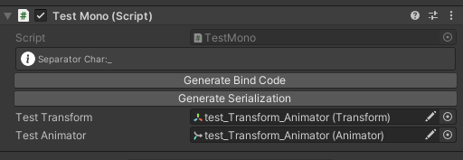
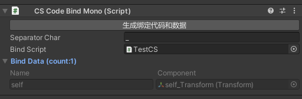

# 代码绑定工具

基于节点命名规则自动生成代码和绑定数据，支持子节点嵌套，自定义命名规则（继承[ICodeBindNameTypeConfig](../Editor/ICodeBindNameTypeConfig.cs)即可）

说明：

节点名字识别支持模糊匹配，比如需要绑定一个变量名为Self的Transform组件，节点名字Self_Tr就可以试别Tr为Transform

节点名字支持绑定多个不同组件，用分隔符连接起来即可，例如：Self_Transform_Button，Self_Tr_But等

## 1.MonoBehaviour类型：

添加特性[MonoCodeBind](../Runtime/CSCodeBindAttribute.cs)即可，指定分隔符参数（可选）

### 使用方式：
```csharp
[MonoCodeBind('_')]
public partial class TestMono : MonoBehaviour
{

}
```


按钮Generate Bind Code：生成绑定代码

按钮Generate Serialization：生成绑定数据

## 2.CSCodeBindMono和ICSCodeBind组合(可热更新)：

[CSCodeBindMono](../Runtime/CSCodeBindMono.cs)保存绑定的数据，绑定类实现[ICSCodeBind](../Runtime/ICSCodeBind.cs)（非MonoBehaviour代码），因此一般有热更需求时候可以用

### 使用方式：


拖入创建的C#脚本到BindScript(-_-!再也不用填写烦人的脚本路径)

```csharp
public partial class TestCS : ICSCodeBind
{
    //something
}
gameObject.GetCSCodeBindObject<TestCS>();//自带对象缓存
```


